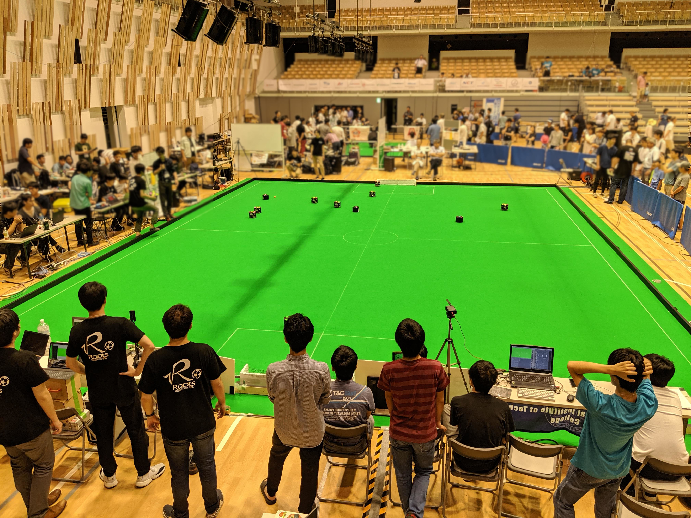

# Roots - RoboCup SSL Team

ここはRoboCup SSLに参加するチーム**Roots**のウェブサイトです。

RoboCup SSLを**知らない人**、**参加したい人**、**すでに参加している人**に向けて
設計資料を公開しています。

|[RoboCup SSLについて](./docs/robocup_ssl/main.md)|[Rootsについて](./docs/roots_main/main.md)| 
|:---:|:---:|
|||

## 設計資料

|[Mechanical](./docs/roots_mechanical/main.md)|[Electrical](./docs/roots_electrical/main.md)|[Software](./docs/roots_software/main.md)|
|:----:|:----:|:----:|
||||

## NEWS

### 2019/09 Roots ウェブサイトのコンテンツをGitHub Pagesに移行

ページの編集方法は[CONTRIBUTING.md](https://github.com/SSL-Roots/Roots_home/blob/master/CONTRIBUTING.md)
を参照してください。

### 2019/12 RoboCup JapanOpen2019 に参加したロボットのアセットを公開

RootsはRoboCup JapanOpen2019へ参加し、準優勝しました。  
以下で、そのロボットのすべてのアセットを公開しています。

[ロボット - JapanOpen 2019 Ver](./docs/roots_main/robot_jo2019.md)

## Contact
- [RoboCup SSL 日本リーグ Slack(どなたでも参加できます）](https://join.slack.com/t/robocup-ssl-japan/shared_invite/enQtMzU5ODI5MzE4MzU4LWFmNWI4OGYzNjJkNGQ1NGNlOTA3ZGE4MzFkNmVkZGMyMjczMWZhODlmZDY3YjA3OWJhZDdiNGU4MGU0Y2MxMjM)

- [Roots Twitter公式アカウント](https://twitter.com/roots_ssl)

- 本ウェブサイトについてのお問い合わせは[SSL-Roots/Roots_homeのIssue](https://github.com/SSL-Roots/Roots_home/issues)に投稿お願いします。

---

(C) 2017 - 2020 Roots

 This page is licensed under a <a rel="license" href="http://creativecommons.org/licenses/by-nc/4.0/">Creative Commons Attribution-NonCommercial 4.0 International License</a>.
