# モータドライバ制御マイコンのファームウェア書き込み方法

`このページでは2017年モデルの設計資料を紹介します`

モータドライバ制御用マイコンにはdsPICを使用しています。

## 1. MicrochipのサイトでMPLAB Xを入手する

1. [Microchipsite](http://www.microchip.com/ja/mplab/mplab-x-ide)に移動する
2. "アーカイブのダウンロード”Tabをクリック。
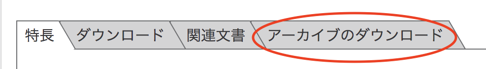{: style="width:640px"}

3. 使用しているOSにあったMPLAB Xをダウンロード　　※’17/7/25時点　MacOSのMPLABXv2.20　をダウンロード
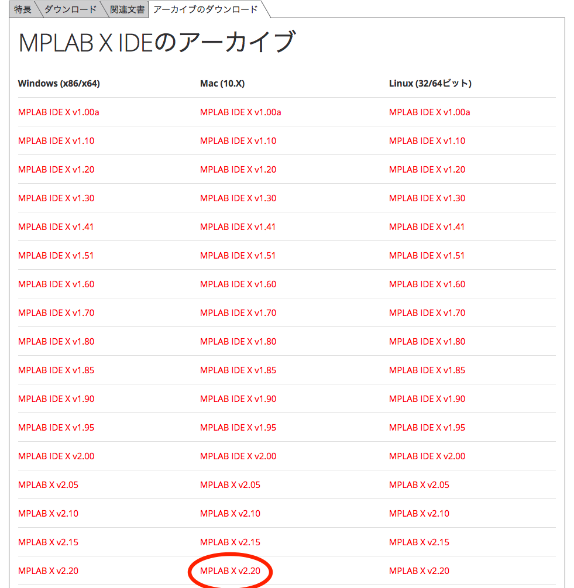

4. ダウンロードしたインストーラを起動※Java(tm)がないと言われたら番外編へ
5. "I accept the agreement"にチェックといれ、"Next"ボタンをクリックし、インストールを進める。
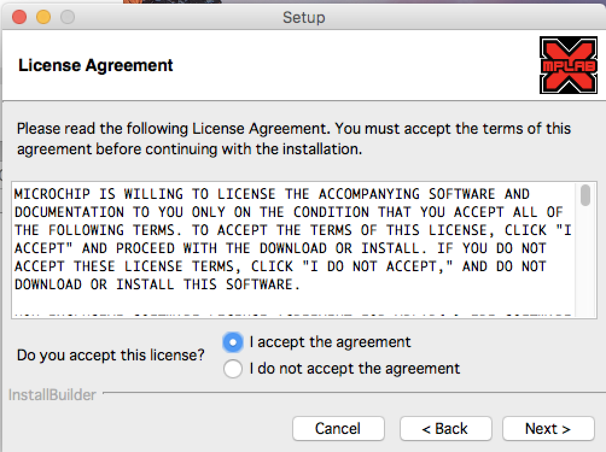

## 2. Microchipのサイトに行き、XCコンパイラを入手する。

1. 右記URLに移動する。
[XC_Compiler](http://www.microchip.com/ja/mplab/compilers)
2. "アーカイブのダウンロード”Tabをクリック。
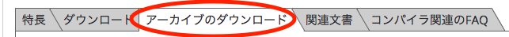

3. 使用しているOSにあったXC16コンパイラをダウンロード　　※’17/7/25時点　MacOSのXC16　v１.22をダウンロード
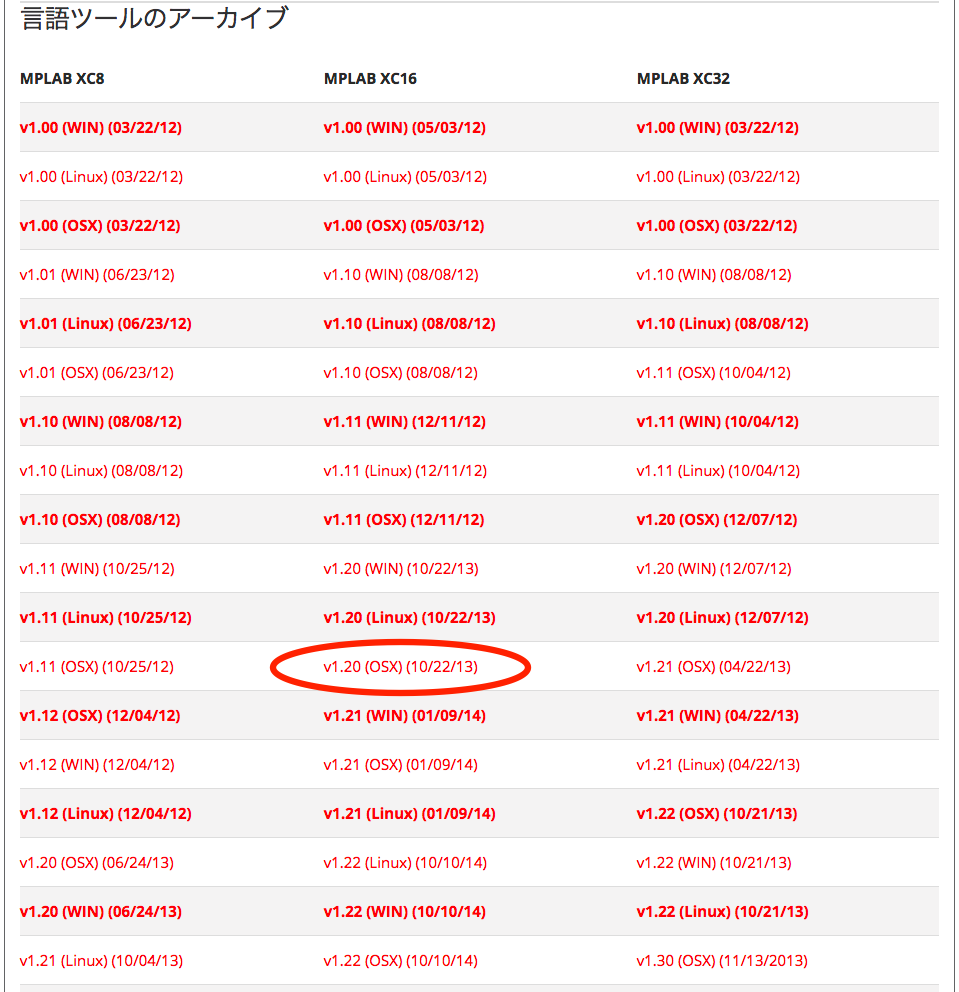

4. ダウンロードしたインストーラを起動
5. "I accept the agreement"にチェックといれ、"Next"ボタンをクリックし、インストールを進める。
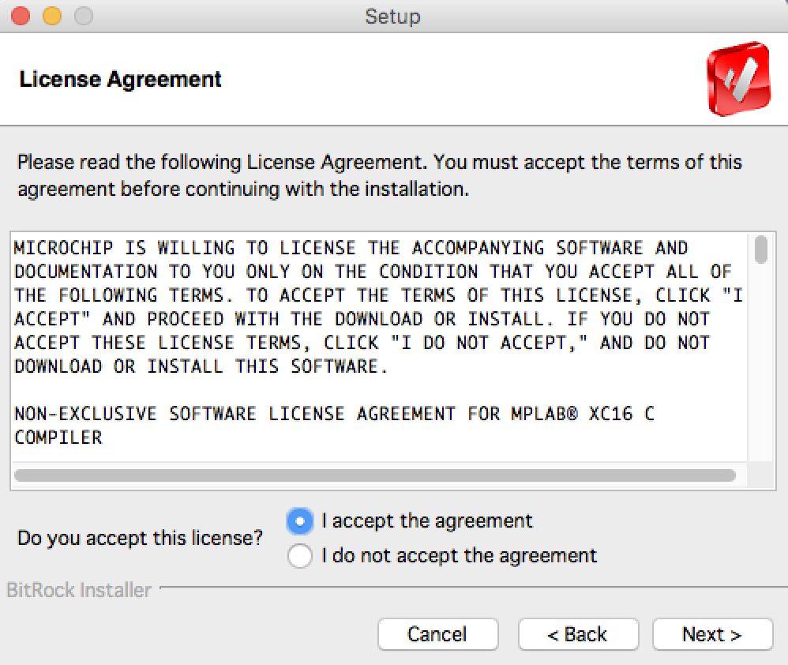

6. ”install　compiler”を選択。
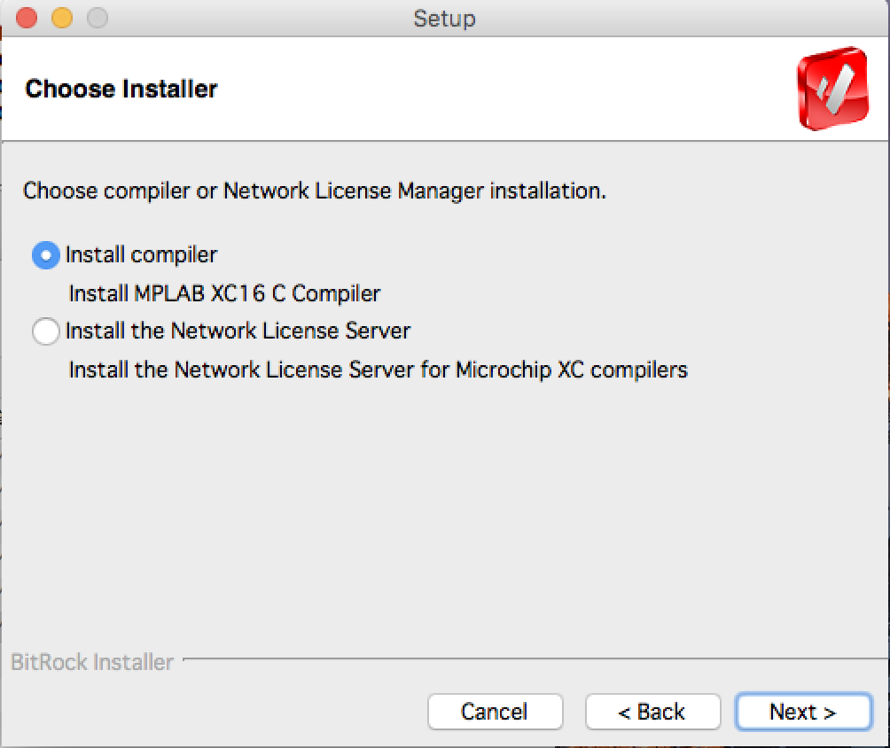

7. "Installation type"ページはそのままで次へ。
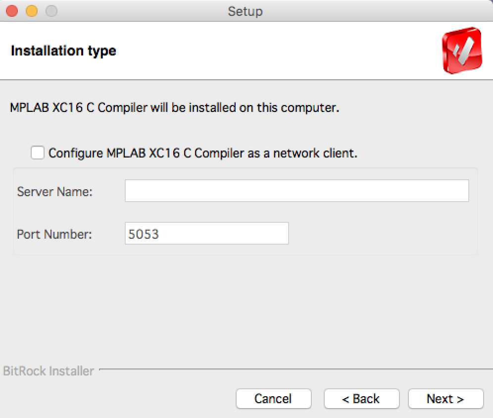

8. 環境変数を追加するためにチェックを入れる。
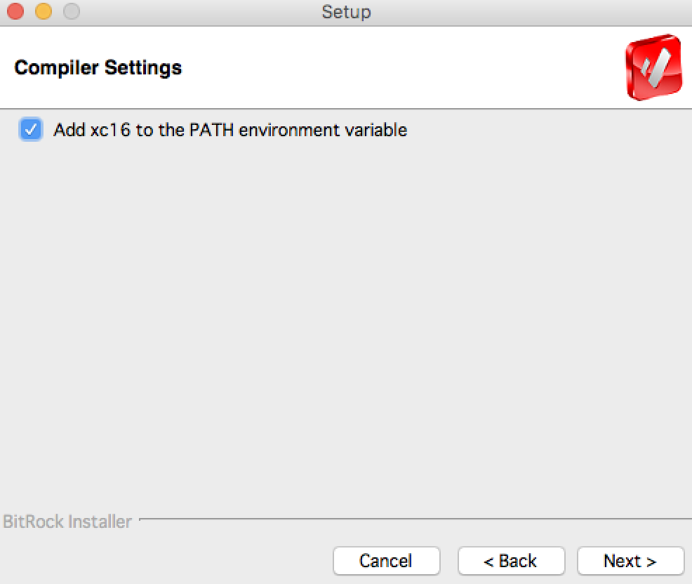

## 3. プログラムをダウンロードする。

1. 右記サイトに移動する。[MotorDriver](https://github.com/SSL-Roots/ROOTS_BLDC_MotorControl)
2. ”clone　or　download”ボタンをクリック。
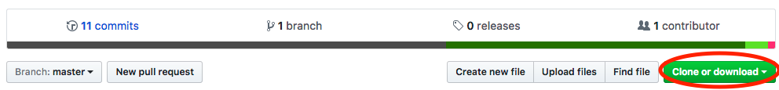

3. "Download　ZIP”ボタンをクリック。
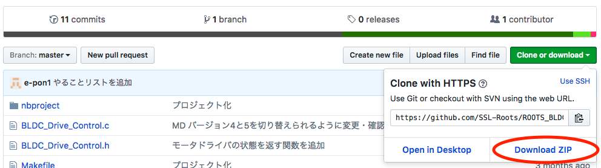

4. ダウンロードしたZIPファイルを解凍する。

## 4. MPLABXでプログラムを開く。

1. MPLABXを起動する。
2. ”Open　Project”ボタンをクリックする。
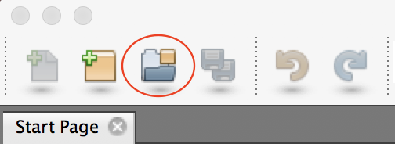

3. ダウンロードしたプログラムを解凍したディレクトリに移動する。
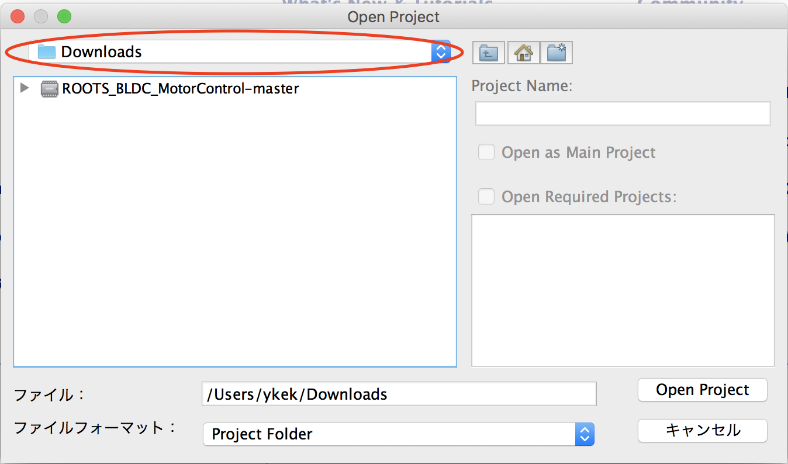

4. "Open”ボタンをクリック。
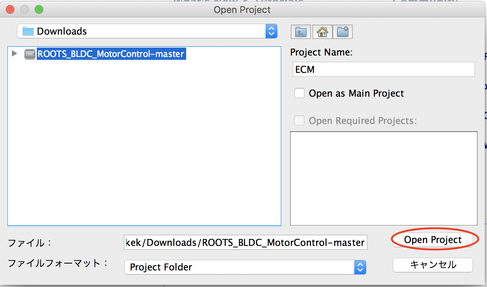

## 5. プログラムをビルドする。

1. ”Clean and Build Project"ボタンをクリック。
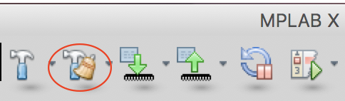

2. ”Output”Tabに”BUILD SUCCESSFUL”と出力されれば、ビルド完了。
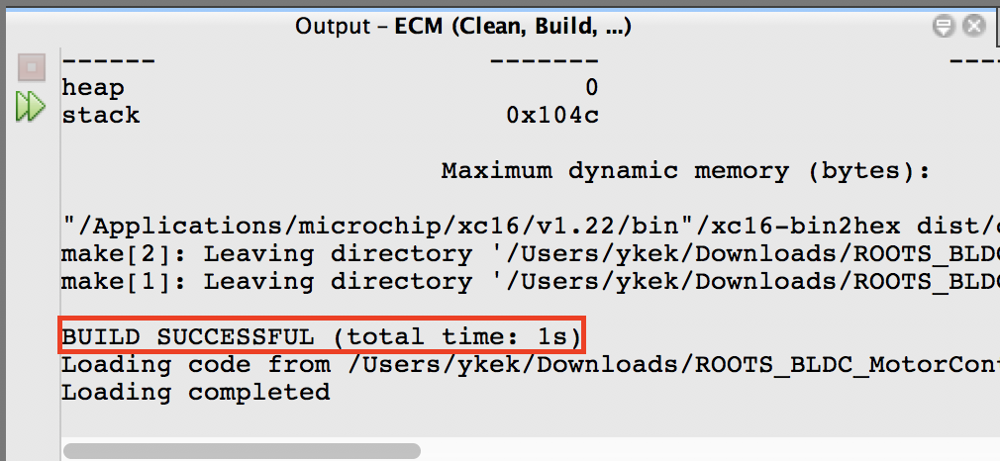

## 6. プログラムを書き込む。

1. Pickit3とMDを以下のように接続する。

`画像準備中です`
<!-- TODO:(ykek)※後に図を差し替える -->

2. "Make and Program Device"ボタンをクリック。

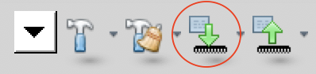

## 番外編：インストール時Java(tm)がないと怒られた場合

1. Javaダウンロードサイトに移動する。[Java:JRE](https://support.apple.com/kb/DL1572?locale=ja_JP)
2. ”ダウンロード”ボタンをクリック。
3. ダウンロードしたインストーラを起動し、インストールする。
