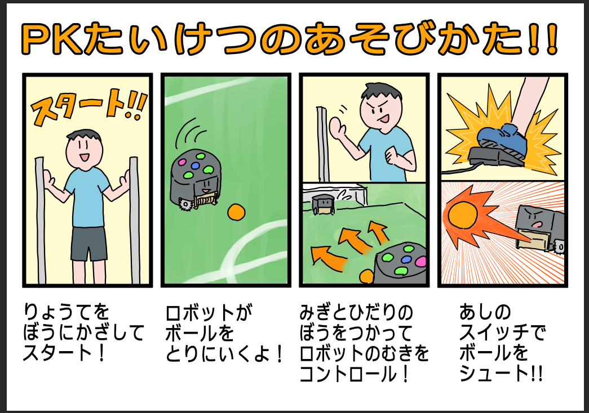

# MakerFaireTokyo2020

2020年10月3日、4日に開催される[Maker Faire Tokyo 2020](https://makezine.jp/event/mft2020/)に出展しました。

今年の展示内容は2つです。

## コロナ対策を考慮した遠隔操縦体験

センサを使ってロボットを遠隔操縦し、PK対決をします。

## Scrambleとのミニ試合

次世代ロボットエンジニア支援機構（通称：Scramble）のSSLチームと試合をします。

## 参考ページ

- [Maker Faire Tokyo2020, Roots出展者ページ](https://makezine.jp/event/makers-mft2020/m0135/)
- [Maker Faire Tokyo 2020でロボットコンテスト出場ロボットを共同出展！10月3日、4日(東京ビッグサイト)](https://prtimes.jp/main/html/rd/p/000000007.000062410.html)
- [一般社団法人次世代ロボットエンジニア支援機構](https://scramble-robot.org/)
