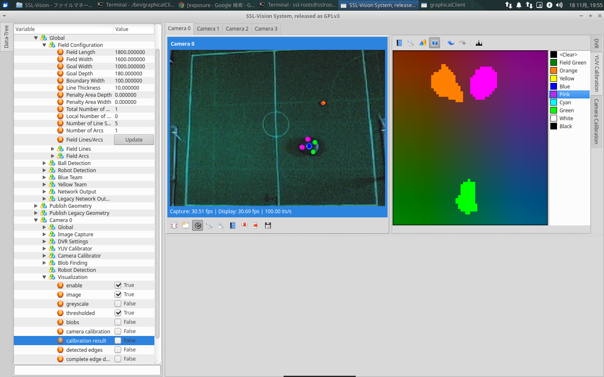

# フィールドセッティング

ロボカップSSLの公式フィールドは個人で準備できないサイズ・コストになります。

そのため、このページでは自宅やイベントに向けた小型フィールドのセッティング方法を説明します。

## 小型フィールドとは？

Rootsは過去2回、Maker Faire TokyoでSSLの展示をしました。


この画像のように、公式フィールドと比べるととても小さいです。

キーパーロボットの動作、ストレートキック、小規模の走行等はテストできます。

しかし、試合プログラムの実機テストにはフィールドが小さいため向いていません。

以上を踏まえて、手順を参考にしてください。

## フィールドセッティングに必要なもの

- フィールド（カーペット）
  - ロボットが走行するために必要です
  - Rootsは[ここで](https://www.yuui.net/products/detail.php?product_id=1070071)購入しました(型番:B.B-211)
- カメラ
  - ロボット・ボールを認識するために必要です
  - SSL公式が推奨するカメラは[こちら](https://github.com/RoboCup-SSL/ssl-vision/wiki/requirements#firewire-camera-recommended-hardware)に記載されています
  - Rootsは簡単に入手できる[USBカメラ](http://buffalo.jp/product/multimedia/web-camera/bsw200m/)を使用しています
  - 安価なカメラを使うことで、解像度が低くなり、ロボット・ボールの検出精度が落ちるというデメリットもあります
  - また、60FPS出力できないため、ロボットの応答性が悪くなる可能性もあります。
- PC
  - SSL-Vision(ロボット・ボールを検出するソフトウェア)を動かすために必要です
  - [公式ページ](https://github.com/RoboCup-SSL/ssl-vision/wiki/requirements#hardware-requirements)では必要スペックが定義されていません。
  - OSはLinux(Ubuntu)推奨です
  - Rootsは*CPU:Intel Core i5-6600K, RAM: 8GB*以上のPCでSSL-Visionが動くことを確認しています。

## フィールドセッティングにあると良いもの

- LANハブ
  - SSL-Visionのデータを複数のPCへ送信するために必要です
- チョーク
  - フィールドにセンターラインやゴールラインを描くために必要です
  - SSL-Visionは白線を検出して画像補正します
- カメラを取り付けるポール
  - カメラを高い位置に取り付けるために必要です
  - Rootsは塩ビパイプを使用しました
- 小さい壁
  - ボールがフィールド外に転がるのを防ぐために必要です
  - Rootsは[こちら](http://www.moriyas.co.jp/product/hoso_konpo/kamikakou/edgeboard.html)の製品をホームセンターで購入しました(型番:MG-306)
- ゴルフボール（オレンジ色）
  - 試合で使うボールです
  - Rootsはスポーツ用品店で購入しました
- ロボットマーカ
  - ロボットの認識に必要なマーカです
  - マーカのサイズ・色の配置は[公式ルール](http://wiki.robocup.org/images/7/73/Small_Size_League_-_Rules_2018.pdf)に記載されています
  - Rootsはホームセンターで色紙を購入して作りました
  - 大会では運営から貰える色紙を使ってください

# 作業手順

SSL-Visionの使い方や、フィールドサイズの定義等は
[SSL-Vision 公式Wiki](https://github.com/RoboCup-SSL/ssl-vision/wiki)の手順に従ってください。

ここではSSL-Vision以外の作業について重点を置き、
フィールドセッティングの手順を説明します。

フィールドセッティングの手順は以下の通りです。

1. カーペットを敷く
1. カメラを配置する
1. SSL-Visionを起動し、カメラ画像を取得する
1. カメラ画像を見ながらフィールド位置・カメラ位置を調整する
1. フィールドに白線を引く
1. SSL-Visionでフィールドをキャリブレーションする
1. フィールドにロボットマーカとボールを置く
1. SSL-Visoinでマーカとボールをキャリブレーションする

## カーペットを敷く

カーペットは平らな地面に敷くことをおすすめします。
段差があるとロボットやボールが引っかかるので注意してください。

### 折りたたみ式カーペット

カーペットの裏にプラスチックダンボールを貼り、折りたためるカーペットを作りました。

持ち運びやすく、収納しやすくなるのでおすすめです。
また、滑り止め用のゴムシートを下に敷くとフィールドを固定できます。


## カメラを配置する

できるだけフィールド全体が平面に撮影できるよう、カーペット中心の上空に配置してください。
斜め方向からフィールドを撮影する場合でも、ある程度はSSL-Visionが補正してくれます。

ここではカメラ位置を**固定しない**でください。次の手順で、カメラ画像を見ながら位置を決定します。


## SSL-Visionを起動し、カメラ画像を取得する

SSL-Visionを起動し、カメラ画像を取得してください。
SSL-Visionの操作方法は[ここ](https://github.com/RoboCup-SSL/ssl-vision/wiki/capturing-images)に書いてあります。

## カメラ画像を見ながらフィールド位置・カメラ位置を調整する

カーペット全体が映るようにカメラ位置、ズーム等を調整してください。

USBカメラを使っている場合、SSL-Visionではカメラのパラメータ（ズーム、シャッター、ピント等）を変更できないかもしれません。
Rootsは[v4l2-ctl](https://www.mankier.com/1/v4l2-ctl)を使ってカメラパラメータを設定しました。

スクリプトファイルを用意すると、パラメータ設定が簡単にできます。

```zsh
#!/bin/zsh

# v4l2-ctl -d 0 -c brightness=0 #default : 0
# v4l2-ctl -d 0 -c contrast=32 #32
# v4l2-ctl -d 0 -c saturation=55 #55
# v4l2-ctl -d 0 -c hue=0 #0 色合い
# v4l2-ctl -d 0 -c gamma=165 #165
#
# v4l2-ctl -d 0 -c power_line_frequency=1 #1
#
v4l2-ctl -d 0 -c white_balance_temperature_auto=0 #1
v4l2-ctl -d 0 -c white_balance_temperature=3000 #4600

# v4l2-ctl -d 0 -c sharpness=2 #2
# v4l2-ctl -d 0 -c backlight_compensation=0 #0
#
v4l2-ctl -d 0 -c exposure_auto=1
v4l2-ctl -d 0 -c exposure_absolute=250 # 166
```

## フィールドに白線を引く

SSL-Visionは白線を検出してカメラ画像を補正します。
カメラ画像から読み取れるよう白線を濃ゆく引いてください。

チョークを使うと、白線を簡単に引くことができ、線の修正も簡単にできます。


## SSL-Visionでフィールドをキャリブレーションする

キャリブレーションの前に、白線の本数・長さを設定します。
[このページ](https://github.com/RoboCup-SSL/ssl-vision/wiki/camera-calibration#field-markings)を参考に、
*Field Configuration*と*Field Lines*、*Field Arcs*を設定してください。

カメラが1台の場合、外枠の四角とセンターサークルだけあればフィールドを作成できます。
このとき、Field Linesは4本、Field Arcsは1本になります。

キャリブレーションの手順は[ここ](https://github.com/RoboCup-SSL/ssl-vision/wiki/camera-calibration#update-control-points)に従ってください。

キャリブレーションの最中は、白線が隠れないようにフィールドから人・モノを取り除いてください。


キャリブレーションが成功するとSSL-Visionはフィールド情報を出力します。
フィールド情報はGraphical Clientで確認できます。```ssl-vision/bin/graphicalClient```を実行してください。


## フィールドにロボットマーカとボールを置く

最後に、ロボットとボールが認識出るように設定します。
SSL-Visionの操作方法は[ここ](https://github.com/RoboCup-SSL/ssl-vision/wiki/color-segmentation-configuration)を確認してください。

マーカの黄色・緑色や、マーカのピンク色・ボールのオレンジ色は外光の影響により区別がつかなくなるかもしれません。
その場合は外光を調整してください。その調整が難しい場合は、カメラのシャッターパラメータを変更すると良いです。



この作業が終わるとSSL-Visionはロボット・ボール座標を出力します。
フィールド情報と同様にGraphical Clientで確認して下さい。


