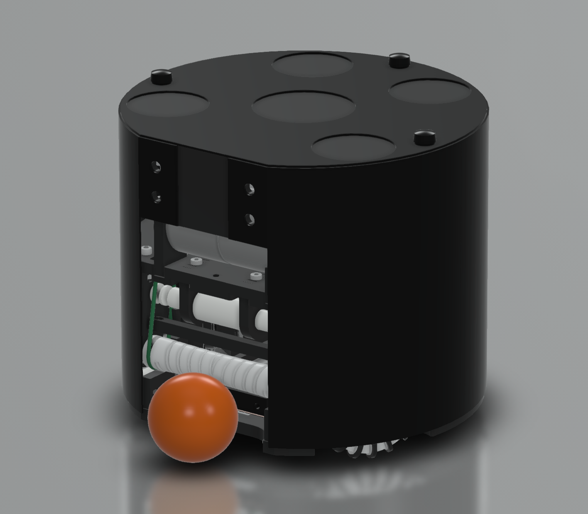
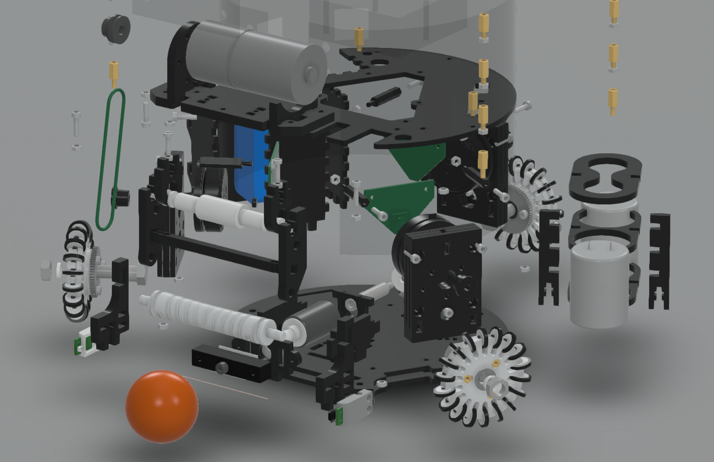

# ロボット本体の設計データ

`このページでは2017年モデルの設計資料を紹介します`

## CADスクリーンショット

## 特徴

Rootsのロボットは、小型リーグへの参入が簡単になるよう、安価かつ簡単に作れるよう設計しています。
ロボットの材料費は6万円強で、これは一般的な他のロボットの6〜7割程度の価格です。
パーツは基本的に既製品かレーザーカットで作るため、Fablabなどで製作が可能です。

経費の詳細は、
[ロボット製作費](./cost_of_robot.md)
をご覧ください。

## CADデータ

RootsのロボットCADデータは以下のURLから確認できます。

[CADデータダウンロード](http://a360.co/2epI1Rg)

データのダウンロードは、上記URLページ右上の「ダウンロード」メニューから行えます。  
ご都合のよいデータ形式を選んで保存してください。

## BOM(部品一覧)

BOMは以下のURLにて確認できます。

[機械部品BOM](https://docs.google.com/spreadsheets/d/1pFAowyvhsac7jMB7xxNabcVMEUmTnnNXP4YJuslIOLk/edit?usp=sharing)

## 分解図

上の画像の図は、[CADデータページ](http://a360.co/2epI1Rg)にあるメニュー「分解モデル」から確認できます。

## 3D View

<iframe src="https://myhub.autodesk360.com/ue290e639/shares/public/SHabee1QT1a327cf2b7aa23114479f95281c?mode=embed" width="1024" height="768" allowfullscreen="true" webkitallowfullscreen="true" mozallowfullscreen="true"  frameborder="0"></iframe>

## ライセンス

ロボットの設計データは
[クリエイティブ・コモンズ 表示 - 非営利 4.0 国際 ライセンス](http://creativecommons.org/licenses/by-nc/4.0/)
の下に提供されています。
