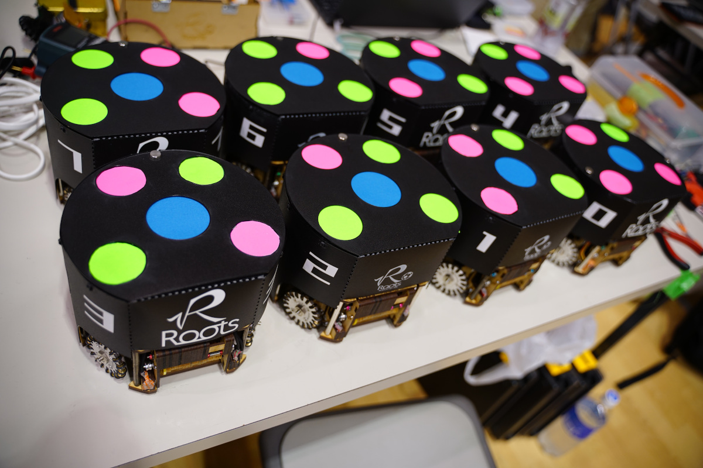
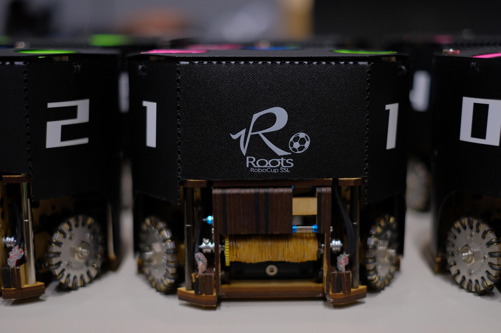
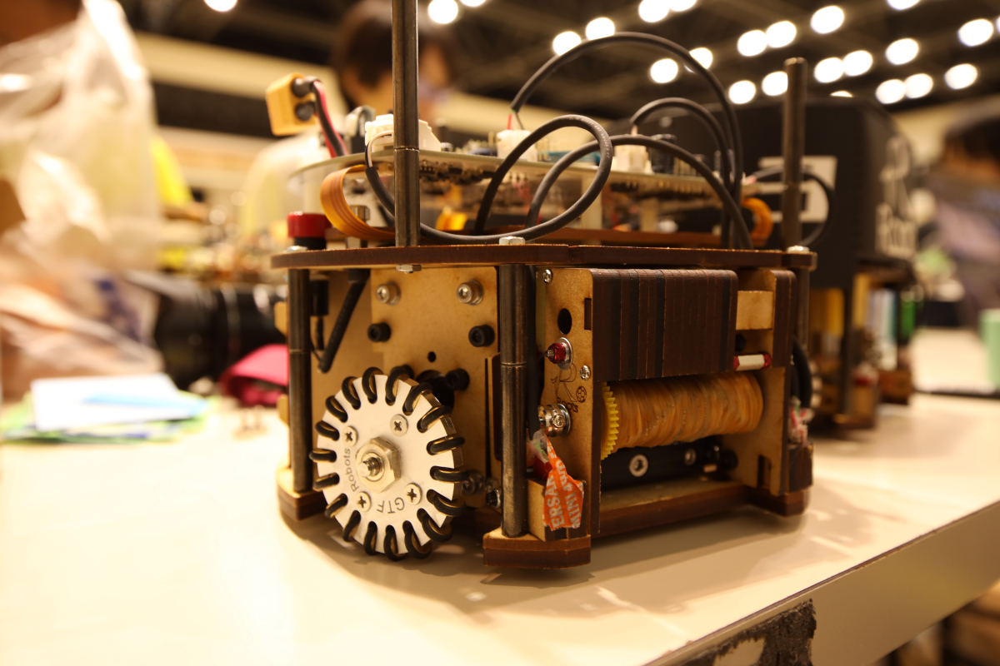
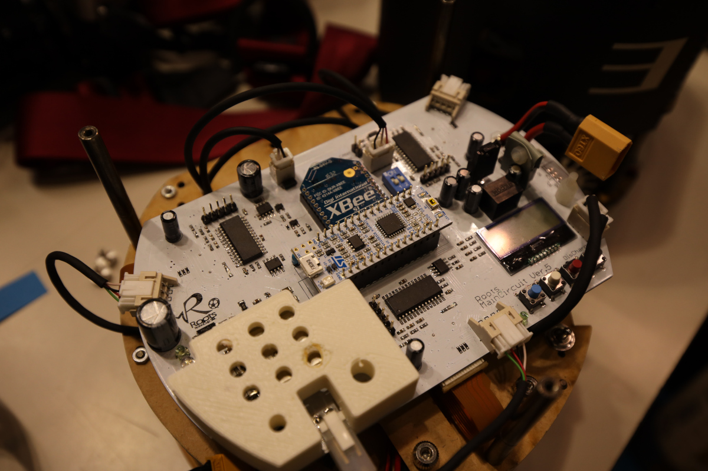
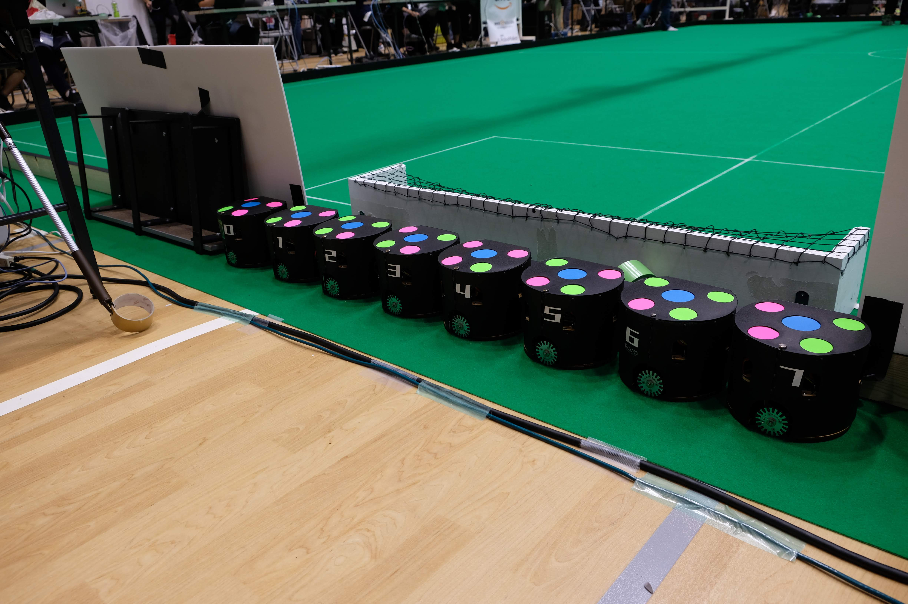

# 設計データ JapanOpen 2019 Ver.

ロボカップジャパンオープン2019で製作したロボットとソフトウェアの設計データです。

## 戦略ソフト

[CON-SAI2](https://github.com/SSL-Roots/consai2)

## メカ

[3D CAD Model](https://a360.co/2mJYBCH)

メカの設計思想がメンバーの個人ブログに詳しくまとめられています。  

- [【SSL】大解剖❗Rootsのロボットはここがスゴい！第０回](https://kuwango.hatenablog.com/entry/2019/08/20/090240)
- [【SSL】大解剖❗Rootsのロボットはここがスゴい！第１回～設計思想編～](https://kuwango.hatenablog.com/entry/2019/08/22/121500)
- [【SSL】大解剖❗Rootsのロボットはここがスゴい！第２回～回路部品編～](https://kuwango.hatenablog.com/entry/2019/09/02/085118)
- [【SSL】大解剖❗Rootsのロボットはここがスゴい！第３回～足回り編～](https://kuwango.hatenablog.com/entry/2019/09/06/231057)
- [【SSL】大解剖❗Rootsのロボットはここがスゴい！第４回～キッカー編～](https://kuwango.hatenablog.com/entry/2019/09/23/075951)
- [【SSL】大解剖❗Rootsのロボットはここがスゴい！第５回～ドリブラ本体編～](https://kuwango.hatenablog.com/entry/2019/10/09/233917)

## 回路

- [回路図(PDF)](https://drive.google.com/open?id=15ZcZXkTQO8EKfN9fWiDip_qolnBo0fbB)  
- [回路概要(PDF)](https://drive.google.com/open?id=1eQ57YusMVFL-WygFOJoyoH8jbAvdra5-)  
- [部品表](https://drive.google.com/open?id=1Y1U8xcwifXOH9cZM7hsw7a6IN30Jqk6StOXAICf5W8Y)  
- [Autodesk Eagle Schema file](https://drive.google.com/open?id=1lBEviJs7r6fzawfN-feYkrRAi2SBt9fg)  
- [Autodesk Eagle Board file](https://drive.google.com/open?id=1gaDT3Kfdr3wBv_L-SYoNdmxJi_Ptdced) 
- [メインマイコン (mbed) ファームウェア](https://os.mbed.com/users/alt0710/code/Roots/)  
- [モータドライバ ファームウェア](https://github.com/SSL-Roots/ROOTS_BLDC_MotorControl)

ボールセンサ基板とエンコーダ基板は、2017年モデルと同じです。

- [ボールセンサ基板](./elec/detail_ball_sensor_pcb.md)
- [エンコーダ基板](./elec/detail_encoder_pcb.md)

## ライセンス

ロボットの設計データは
[クリエイティブ・コモンズ 表示 - 非営利 4.0 国際 ライセンス](http://creativecommons.org/licenses/by-nc/4.0/)
の下に提供されています。

GitHubリポジトリやmbedリポジトリにアップロードしたデータのライセンスについては、
それぞれのライセンスファイルを参照してください。

## 写真

    

    

    

