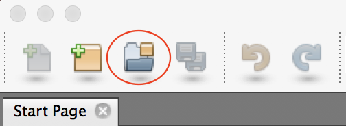
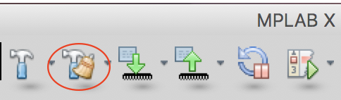

# モータドライバ制御マイコンのファームウェア書き込み方法

モータドライバ制御用マイコンにはdsPICを使用しています。

## 1. Microchipのサイトに行き、MPLAB　Xを入手する。
1. [Microchipsite](http://www.microchip.com/ja/mplab/mplab-x-ide)に移動する
2. "アーカイブのダウンロード”Tabをクリック。

3. 使用しているOSにあったMPLAB Xをダウンロード　　※’17/7/25時点　MacOSのMPLABXv2.20　をダウンロード

4. ダウンロードしたインストーラを起動※Java(tm)がないと言われたら番外編へ
5. "I accept the agreement"にチェックといれ、"Next"ボタンをクリックし、インストールを進める。

## 2. Microchipのサイトに行き、XCコンパイラを入手する。
1. 右記URLに移動する。
[XC_Compiler](http://www.microchip.com/ja/mplab/compilers)
2. "アーカイブのダウンロード”Tabをクリック。

3. 使用しているOSにあったXC16コンパイラをダウンロード　　※’17/7/25時点　MacOSのXC16　v１.22をダウンロード

4. ダウンロードしたインストーラを起動
5. "I accept the agreement"にチェックといれ、"Next"ボタンをクリックし、インストールを進める。

6. ”install　compiler”を選択。

7. "Installation type"ページはそのままで次へ。

8. 環境変数を追加するためにチェックを入れる。

## 3. プログラムをダウンロードする。
1. 右記サイトに移動する。[MotorDriver](https://github.com/SSL-Roots/ROOTS_BLDC_MotorControl)
2. ”clone　or　download”ボタンをクリック。

3. "Download　ZIP”ボタンをクリック。

4. ダウンロードしたZIPファイルを解凍する。

## 4. MPLABXでプログラムを開く。
1. MPLABXを起動する。
2. ”Open　Project”ボタンをクリックする。

3. ダウンロードしたプログラムを解凍したディレクトリに移動する。

4. "Open”ボタンをクリック。

## 5. プログラムをビルドする。
1. ”Clean and Build Project"ボタンをクリック。

2. ”Output”Tabに”BUILD SUCCESSFUL”と出力されれば、ビルド完了。

## 6. プログラムを書き込む。
1. Pickit3とMDを以下のように接続する。

`画像準備中です`
<!-- TODO:(堀江)※後に図を差し替える -->
<!--  -->

2. "Make and Program Device"ボタンをクリック。

## 番外編：インストール時Java(tm)がないと怒られた場合
1. Javaダウンロードサイトに移動する。[Java:JRE](https://support.apple.com/kb/DL1572?locale=ja_JP)
2. ”ダウンロード”ボタンをクリック。
3. ダウンロードしたインストーラを起動し、インストールする。
