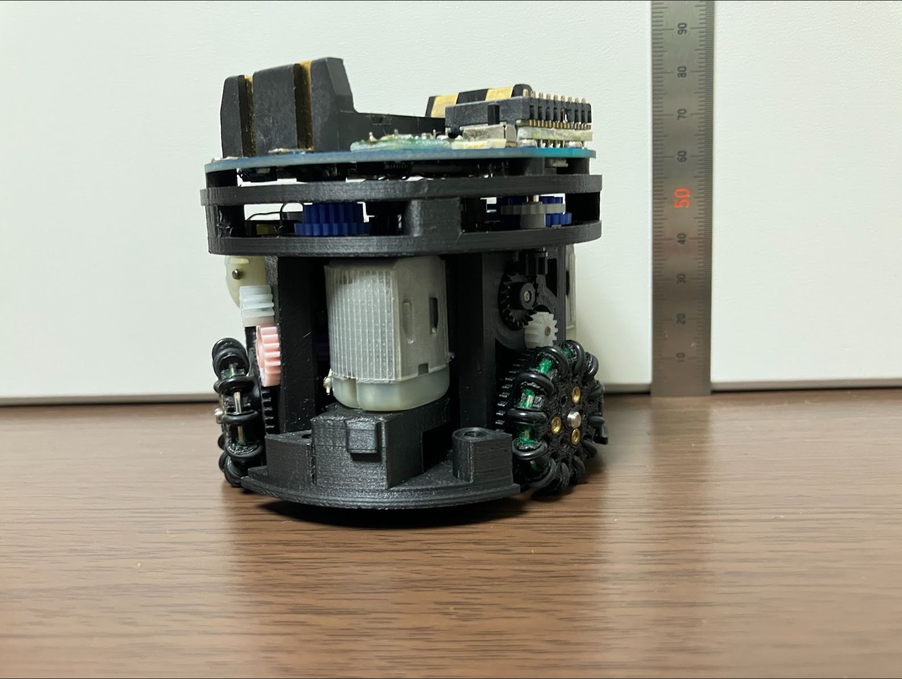

# SSLよりもっと小さいロボットに挑戦

RoboCup SSL（ロボカップサッカー小型ロボットリーグ）では直径18 cmのロボットを11台用意してサッカーを行います。

フィールドサイズは12 m x 9 mです。

これは...**とても大きい！** Not small size です！

ロボットがもっと小さければ、フィールドがもっと小さければ、  
**もっと手軽にRoboCup SSLを楽しむ**ことができるのではないでしょうか？

## もっと小さいロボットを作ってみました

日本のロボカップSSLチームである**Roots**と[OP-AmP](https://sites.google.com/view/op-amp/home/activity)
が、
もっと小さいSSLロボット作りに挑戦しています。

## 現在の取り組みについて

**できるだけRoboCup SSLの資産を流用する**
という方針で、いくつかルールを設けてロボットを作っています。

### ロボットのサイズは直径10 cm以下

ロボットの直径は10 cm 以下にします。
まさに手のひらサイズのロボットです。

Rootsは直径8 cmのロボットを作りました。

SSLでおなじみのビジョンマーカも使用します。
もちろんサイズは小さくなります。

マーカの寸法はこちらです。

### バッテリに使えるのは乾電池のみ

**安全のため**、ロボットのバッテリには乾電池のみを使用できます。

ロボットのバッテリには、Li-PoやLi-Feなどのパワフルなものよく使用されます。
これらのバッテリは、大きなエネルギーを持つ反面、取り扱いに注意が必要です。

**もっと手軽にRoboCup SSLを楽しむ**ために、比較的安全に使える乾電池を使用します。

### テーブルサッカー用のボールを使用する

**できるだけRoboCup SSLの資産を流用する**ためには、**オレンジ色の小さいボール**が必要です。

そこで、テーブルサッカー（FoosBall）で使用されるボールを選びました。
直径は約3.2 cmです。  

## ロボットのスペック

### 2024年版のロボットスペック

| 項目 | スペック |
| --- | --- |
| バッテリ | Panasonic eneloop BK-3MCD x2 |
| モータ | タミヤ FA-130 |
| ホイール | 自作3Dプリント製オムニホイール x3 |
| ギア比 | 1:33.3 |
| キッカー | ラックアンドピニオンとバネ（未完成） |
| ドリブラー | 3Dプリント製ローラー（未完成） |
| メインマイコン | M5Stamp S3 |
| PCとの通信 | 2.4 GHz Wi-Fi |

### 2024年版のロボット画像

